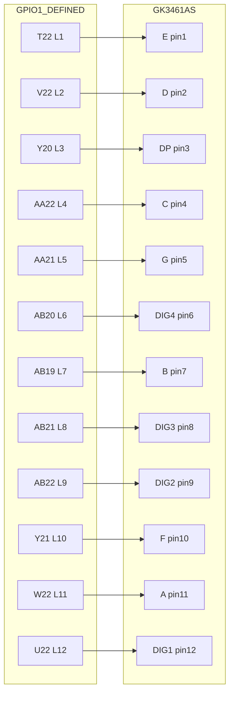

# 外设硬件方案（GPIO1 排线 + 面包板）

## 1. 结论先说
- 不需要额外电池。
- 这块板在排针上已经提供了标准电源：+5V、3V3、GND。
- 你的外设（GK3461AS 七段管、蜂鸣器、开关）建议都从 GPIO1 排线引到面包板实现。

## 2. 供电依据
- 文档说明 PL 相关 IO 为 3.3V 体系，可按 LVCMOS33 使用：
  - [reference/LXB-ZYNQ/README.md](reference/LXB-ZYNQ/README.md#L35)
  - [reference/LXB-ZYNQ/02_HelloZynq简介/HelloZynq简介.md](reference/LXB-ZYNQ/02_HelloZynq简介/HelloZynq简介.md#L14)
- 你提供的板子照片中，GPIO 排针侧边丝印明确有 +5V、3V3、GND：
  - [board.jpg](board.jpg)

## 3. 施工前约定（线号规则）
- 下文使用 W01、W02... 表示杜邦线编号，按这个编号一根根接。
- GPIO1 右侧双排和左侧双排都能用，这里按你的要求统一使用 BANK33 管脚。
- 面包板电源轨默认：红轨是 3V3，蓝轨是 GND。

### 3.2 BANK33 实物丝印可用脚位（按补充丝印图）
- 已按 BANK33 丝印图重新核对，GPIO1/BANK33 区域无 T21。
- BANK33 丝印两列可见脚位（从电源脚往下）为：

| 左列 | 右列 |
| --- | --- |
| +5V | +5V |
| 3V3 | 3V3 |
| GND | GND |
| V15 | V14 |
| Y14 | AA14 |
| W16 | Y16 |
| AA17 | AB17 |
| W18 | W17 |
| V13 | W13 |
| Y13 | AA13 |
| AB14 | AB15 |
| Y18 | AA18 |
| AB16 | AA16 |
| AA19 | Y19 |
| AB19 | AB20 |
| AB21 | AA21 |
| AB22 | AA22 |
| Y21 | Y20 |
| W22 | V22 |
| U22 | T22 |

### 3.1 板载按键与复位约定（本阶段）
- KEY1（J20）定义为反应键 `btn_react_raw`。
- KEY2（K21）定义为开始键 `btn_start_raw`。
- `rst_n` 使用 GPIO1 的 Y19，低电平有效（按下复位）。
- 接线建议：Y19 一端接复位按键，按键另一端接 GND；默认由上拉保持高电平。

## 4. 电源线（先接这 2 根）
- W01：GPIO1 的 3V3 管脚 -> 面包板红电源轨。
- W02：GPIO1 的 GND 管脚 -> 面包板蓝地轨。
- 说明：先不要接 +5V。七段管和逻辑默认全部用 3V3 方案。

## 5. 七段管（GK3461AS）逐线接法
> 本阶段按你的决定先采用“段线接阳极、位选接阴极”的共阴假设。
> 逻辑电平对应：段线通常高有效、位选通常低有效；最终以实测单段点亮为准。
> 走线规则：LED 管脚按 1->12 逆时针顺序，与 GPIO1 物理顺序一一对应，优先不交叉。

### 5.1 器件脚位
- 位选公共脚：DIG1=12，DIG2=9，DIG3=8，DIG4=6
- 段脚：A=11，B=7，C=4，D=2，E=1，F=10，G=5，DP=3

### 5.1.1 GPIO1 -> GK3461AS 图示（按最新定义，重点含 12 脚）


### 5.1.2 GK3461AS 12 脚封装示意（正视图）
```text
       +-------------------+
  1  E | o               o | 12 DIG1
  2  D | o               o | 11 A
  3 DP | o               o | 10 F
  4  C | o               o |  9 DIG2
  5  G | o               o |  8 DIG3
  6 DIG4| o              o |  7 B
       +-------------------+

关键对应：12脚 = DIG1 = GPIO1 U22 = 顶层 dig1
```

### 5.2 GPIO1 到七段管逐线表（严格按 LED 1->12 顺序）

| 线号 | GPIO1 FPGA pin | 对应 LED 脚号 | GK3461AS 功能 | 顶层端口名 | 串联器件 |
| --- | --- | --- | --- | --- | --- |
| W03 | T22 | 1 | E | seg_e | 330R~1k |
| W04 | V22 | 2 | D | seg_d | 330R~1k |
| W05 | Y20 | 3 | DP | seg_dp | 330R~1k |
| W06 | AA22 | 4 | C | seg_c | 330R~1k |
| W07 | AA21 | 5 | G | seg_g | 330R~1k |
| W08 | AB20 | 6 | DIG4 | dig4 | 直连或位选驱动 |
| W09 | AB19 | 7 | B | seg_b | 330R~1k |
| W10 | AB21 | 8 | DIG3 | dig3 | 直连或位选驱动 |
| W11 | AB22 | 9 | DIG2 | dig2 | 直连或位选驱动 |
| W12 | Y21 | 10 | F | seg_f | 330R~1k |
| W13 | W22 | 11 | A | seg_a | 330R~1k |
| W14 | U22 | 12 | DIG1 | dig1 | 直连或位选驱动 |

### 5.3 位选驱动建议
- 快速演示可先直连 W11~W14（亮度较低，且要控制占空比）。
- 长时间稳定运行建议在 W11~W14 加位选三极管/MOS 管驱动。

## 6. 蜂鸣器逐线接法（不走电池）
- W15：V15 -> 1k 电阻 -> NPN 三极管基极（例如 S8050/2N2222）。
- W16：三极管发射极 -> 面包板 GND 轨。
- W17：蜂鸣器负极 -> 三极管集电极。
- W18：蜂鸣器正极 -> 面包板 3V3 轨（优先先用 3V3，声音不够再评估 5V）。
- 说明：GPIO 只出控制信号，蜂鸣器电流由 3V3 提供，不要 GPIO 直接供电。

## 7. 外接开关（可选）
- 你如果要面包板上的 START/REACT 开关，再各占一个空闲 GPIO pin。
- 开关推荐接法：一端接 3V3，另一端接 GPIO 输入，同时加 10k 下拉到 GND（或在 RTL 内部上拉/下拉策略统一）。
- 复位键例外：`rst_n` 采用低有效，建议接法为 Y19 + 按键到 GND（利用内部上拉）。

## 8. 对应 XDC 端口关系（按本方案）
- K21 -> btn_start_raw（KEY2）
- J20 -> btn_react_raw（KEY1）
- Y19 -> rst_n（低有效）
- T22 -> seg_e
- V22 -> seg_d
- Y20 -> seg_dp
- AA22 -> seg_c
- AA21 -> seg_g
- AB20 -> dig4
- AB19 -> seg_b
- AB21 -> dig3
- AB22 -> dig2
- Y21 -> seg_f
- W22 -> seg_a
- U22 -> dig1
- V15 -> buzzer_pwm

## 9. 上电前检查清单（非常重要）
1. 先断电检查，确认没有把 3V3 和 GND 短接。
2. 8 条段线都串了限流电阻。
3. 蜂鸣器没有直接接 GPIO 作为电源。
4. 面包板地轨与开发板 GND 已共地。
5. 首次上电先只接 W01~W10 做单段测试，再接 DIG 和蜂鸣器。

## 10. 你当前板子的已知风险点
- V1.0 版本有丝印/排针标识历史问题，接线时优先按补充丝印图和实测确认：
  - [reference/LXB-ZYNQ/10_硬件原理图/readme.md](reference/LXB-ZYNQ/10_硬件原理图/readme.md#L3)
  - [reference/LXB-ZYNQ/10_硬件原理图/ZYNQ-7000-V1.0版本补充丝印图_页面_2.png](reference/LXB-ZYNQ/10_硬件原理图/ZYNQ-7000-V1.0版本补充丝印图_页面_2.png)
- 若发现 GPIO1 丝印和实际行为不一致，优先以你板子丝印实物和万用表测得电源脚为准。
